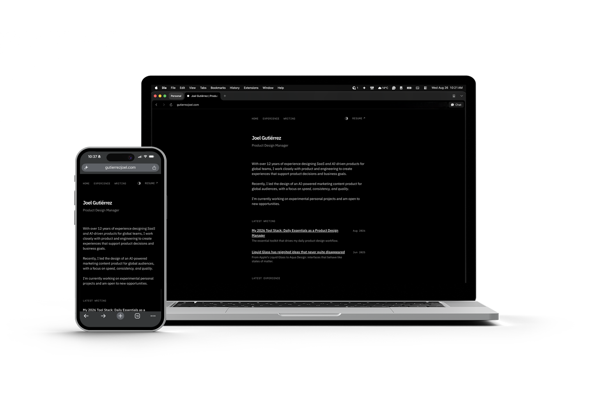

# [gutierrezjoel.com](https://www.gutierrezjoel.com)

This repository is the source for [gutierrezjoel.com](https://www.gutierrezjoel.com), my personal website as a Product Design Manager. It is a small, content-first portfolio: a home page, an experience section, and writing.

I author the content in MDX. Routing, metadata, theming, and SEO live in the Next.js App Router. I designed and built it in Cursor with Next.js and Tailwind CSS, typeset in IBM Plex, and hosted it on Vercel.

The code is open if you want to learn from it or use it as a starting point. If you do, a mention in your site credits is appreciated :)



## Stack


| Layer        | Choice                                             |
| ------------ | -------------------------------------------------- |
| Framework    | Next.js 16 (App Router)                            |
| UI           | React 19, Tailwind CSS v4, IBM Plex Sans and Mono  |
| Content      | MDX via `next-mdx-remote`                          |
| Language     | TypeScript                                         |
| Highlighting | sugar-high                                         |
| Theming      | Light, dark, and system (stored in `localStorage`) |
| Tooling      | pnpm, PostCSS                                      |
| Hosting      | Vercel                                             |


## Requirements

- Node.js 24
- [pnpm](https://pnpm.io/installation) 11


## Usage

```bash
pnpm install
pnpm dev
```

The site runs at [http://localhost:3000](http://localhost:3000).


| Command      | Purpose                                             |
| ------------ | --------------------------------------------------- |
| `pnpm dev`   | Development server                                  |
| `pnpm build` | Production build                                    |
| `pnpm start` | Serve the production build (run `pnpm build` first) |


## Content

Writing and experience are MDX collections. The filename is the slug. Publishing a new `.mdx` file updates the matching index, the home previews (latest three items), and the sitemap automatically.

### Writing

Posts live in `app/writing/posts/`. `liquid-glass.mdx` becomes `/writing/liquid-glass`. The index is `/writing`. Posts sort by `publishedAt`, newest first.

Images referenced in a post live under `public/writing/<slug>/`. Use the same path in frontmatter and in Markdown (`/writing/<slug>/hero.jpg`).

Minimum frontmatter:

```mdx
---
title: 'Article title'
publishedAt: '2026-08-20'
summary: 'Short description used in listings and Open Graph.'
---
```


| Field         | Required | Notes                                                                                                      |
| ------------- | -------- | ---------------------------------------------------------------------------------------------------------- |
| `title`       | Yes      | Page title and listing heading                                                                             |
| `publishedAt` | Yes      | `YYYY-MM-DD`. Listings show month and year                                                                 |
| `summary`     | Yes      | Listing subtitle, meta description, and Open Graph                                                         |
| `image`       | No       | Open Graph image, rooted at `public/`. If omitted, `/og` generates one from the title                      |
| `medium`      | No       | Canonical URL on Medium. The article page adds a “View on Medium” link, and SEO uses that URL as canonical |


Each article includes JSON-LD (`BlogPosting`). Old `/blog` URLs redirect permanently to `/writing`.

### Experience

Entries live in `app/experience/posts/`. `marketfully.mdx` becomes `/experience/marketfully`. The index is `/experience`. Entries sort by `endedAt`, then `startedAt`, newest first.

Listings show the role in front of the summary when `role` is set, and a year range from `startedAt`–`endedAt`. The entry page shows a metadata grid (role, type, industry, mode, start, end).

Minimum frontmatter:

```mdx
---
title: 'Company or project'
startedAt: '2022'
endedAt: '2025'
summary: 'Short description used in listings and Open Graph.'
---
```


| Field       | Required | Notes                                                                              |
| ----------- | -------- | ---------------------------------------------------------------------------------- |
| `title`     | Yes      | Company or project name                                                            |
| `startedAt` | Yes      | Year (`YYYY`). Used for listing range and sort                                     |
| `endedAt`   | Yes      | Year (`YYYY`). Used for listing range, sort, and sitemap                           |
| `summary`   | Yes      | Listing subtitle, meta description, and Open Graph                                 |
| `role`      | No       | Shown on the entry page and prepended to the listing summary                       |
| `type`      | No       | e.g. Full-time, Project                                                            |
| `industry`  | No       | Shown on the entry page                                                            |
| `workplace` | No       | Shown as Mode (Remote, Hybrid, On-site)                                            |
| `startedOn` | No       | `YYYY-MM`. Finer start date on the entry page; falls back to `startedAt`           |
| `endedOn`   | No       | `YYYY-MM`. Finer end date on the entry page; falls back to `endedAt`, then Present |
| `image`     | No       | Open Graph image. If omitted, `/og` generates one from the title                   |


Each entry includes JSON-LD (`CreativeWork`). Old `/experience/getgloby` and `/experience/rehab-boost` URLs redirect to the current entries.

## Configuration


| What                                 | Where                                            |
| ------------------------------------ | ------------------------------------------------ |
| Canonical URL                        | `baseUrl` in `app/sitemap.ts` (SEO, OG, JSON-LD) |
| Site title and description           | `metadata` in `app/layout.tsx`                   |
| Home                                 | `app/page.tsx`                                   |
| Navigation, theme toggle, and resume | `app/components/nav.tsx`                         |
| Footer                               | `app/components/footer.tsx`                      |
| Resume PDF                           | `public/Joel_Gutierrez_Resume.pdf`               |


## Structure

```
app/
  page.tsx                    Home (bio, writing, experience, education)
  layout.tsx                  Layout, fonts, and global metadata
  writing/page.tsx            Writing index
  writing/[slug]/page.tsx     Article (includes JSON-LD)
  writing/posts/              Writing MDX
  writing/utils.ts            Post loading and dates
  experience/page.tsx         Experience index
  experience/[slug]/page.tsx  Experience entry (includes JSON-LD)
  experience/posts/           Experience MDX
  experience/utils.ts         Entry loading and sort
  components/                 Shared UI (nav, theme, MDX, listings)
  lib/theme.ts                Light / dark / system theme
  og/route.tsx                Fallback Open Graph images
  sitemap.ts                  Sitemap and baseUrl
  robots.ts
  manifest.ts
```


## Deploy

The project is set up for Vercel. `baseUrl` in `app/sitemap.ts` already matches the live domain. If you deploy your own copy, point it at yours.

## Using this project

The code is there to learn from or use as a starting point. The writing, experience, images, resume, and home copy are mine. If you fork the repo, replace:

- `app/writing/posts/`
- `app/experience/posts/`
- `public/writing/`
- `public/Joel_Gutierrez_Resume.pdf`
- Home copy in `app/page.tsx`
- Site title and description in `app/layout.tsx`

If you use it, a mention in your site credits is appreciated. Something like:

> Built from [gutierrezjoel.com](https://www.gutierrezjoel.com) by Joel Gutiérrez.


## Contributing

This is a personal site. I'm not looking for features, pull requests, or anything along those lines.

## License

MIT. See [LICENSE](LICENSE).

## Contact

- [gutierrezjoel.com](https://www.gutierrezjoel.com)
- [LinkedIn](https://linkedin.com/in/gutierrezjoel)

